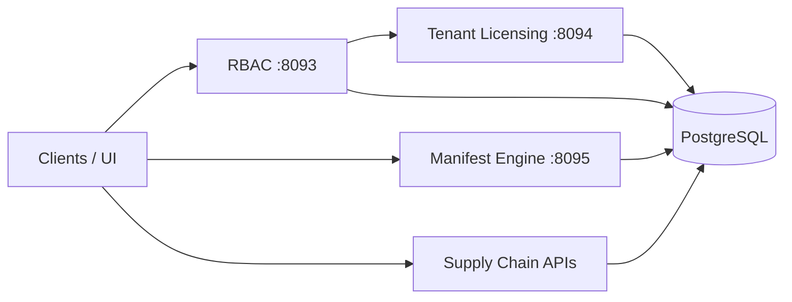

# Maniforge

[](https://github.com/Maniforge/maniforge_low_code_platform/actions/workflows/ci-go.yml)
[](https://github.com/Maniforge/maniforge_low_code_platform/actions/workflows/rbac-checks.yml)
[](https://go.dev/)
[](https://www.postgresql.org/)
[](LICENSE)

**API-first платформа** для сборки backend из модулей: multi-tenant, RBAC, лицензирование, Manifest Engine (сущность → REST API + OpenAPI + UI), supply chain (products / warehouses / inventory / WMS).

> Не «low-code для бизнес-пользователя». Движок для разработчиков, интеграторов и технических предпринимателей: конфигурация и модули вместо бэкенда с нуля.

| | |
|---|---|
| Обзор | [`docs/MANIFORGE_PLATFORM_OVERVIEW.md`](docs/MANIFORGE_PLATFORM_OVERVIEW.md) |
| Видение | [`docs/MANIFORGE_VISION.md`](docs/MANIFORGE_VISION.md) |
| Архитектура | [`docs/MANIFORGE_ARCHITECTURE.md`](docs/MANIFORGE_ARCHITECTURE.md) |
| Структура репо | [`STRUCTURE.md`](STRUCTURE.md) |
| OpenAPI | [`docs/openapi/`](docs/openapi/) |

---

## Возможности

- **Manifest Engine** — описание сущности → REST, field-level API, OpenAPI, UI-заготовки
- **RBAC + 152-ФЗ** — сессии, роли, политики, MFA, audit, персональные данные
- **Tenant Licensing** — планы, квоты, lifecycle тенантов, делегирование (agency grants)
- **Supply chain** — products, warehouses, inventory, WMS / scanner
- **Versioning & Realtime** — история изменений и live-события
- **Два контура** — Go (продакшн) + PHP (референс контрактов и journey-тестов)



## Стек

| Слой | Технологии |
|------|------------|
| Runtime | **Go 1.25 + Fiber** |
| БД | **PostgreSQL 16** (`docker-compose`, порт `5433`) |
| Референс | PHP 8 + journey HTTP-тесты |
| Frontend | React / Refine (admin + WMS scanner) |
| Контракты | OpenAPI YAML / автоген Manifest |

## Production box (v0.1.0-box)

Продаваемый деплой — репозиторий **[Maniforge/Maniforge](https://github.com/Maniforge/Maniforge)** (platform-core, tag [0.1.0-box](https://github.com/Maniforge/Maniforge/releases/tag/v0.1.0-box)). Подробности: [docs/PRODUCTION_BOX.md](docs/PRODUCTION_BOX.md).

`ash
git clone --branch platform-core https://github.com/Maniforge/Maniforge.git
cd Maniforge   # или сразу: git clone ... /opt/maniforge/platform-core
cp deploy/.env.platform.server.example deploy/.env.platform
# отредактируйте секреты в deploy/.env.platform — не коммитьте файл
sudo bash deploy/scripts/install-production.sh --skip-apt --non-interactive
bash deploy/scripts/verify-production.sh
`

## Быстрый старт

Требования: Docker (или `docker-compose`), Go 1.25+, PHP 8.2+ (для web/journeys), Make.

```bash
git clone https://github.com/Maniforge/maniforge_low_code_platform.git
cd maniforge_low_code_platform
cp .env.example .env

make pg-up          # PostgreSQL :5433
make deps
make build
make migrate
make preflight
```

Запуск сервисов (отдельные терминалы):

```bash
make run-rbac         # http://127.0.0.1:8093
make run-tl           # http://127.0.0.1:8094
make run-manifest     # http://127.0.0.1:8095
make run-web          # http://127.0.0.1:8092
```

Проверка:

```bash
make health
# или
curl -s http://127.0.0.1:8093/rbac/health
curl -s http://127.0.0.1:8094/tenant-licensing/health
curl -s http://127.0.0.1:8095/health
```

Локальные демо-учётки (см. `.env.example`): `demo-admin` / `DemoAdmin!12345`.

## Модули

| Модуль | Описание | Порт (Go) |
|--------|----------|-----------|
| **RBAC** | Auth, роли, политики, MFA, audit, 152-ФЗ | `:8093` |
| **Tenant Licensing** | Тенанты, планы, квоты, lifecycle | `:8094` |
| **Manifest Engine** | Сущность → API + OpenAPI + UI | `:8095` |
| **Versioning** | Версии сущностей | `:8096` |
| **Realtime** | WebSocket / live | `:8097` |
| **Products / Warehouses / Inventory / WMS** | Supply chain | отдельные `cmd/*` |

PHP-референс: `app/Maniforge/*`, `maniforge/*/`.

## Документация

| Документ | Содержание |
|----------|------------|
| [`docs/MANIFORGE_ARCHITECTURE.md`](docs/MANIFORGE_ARCHITECTURE.md) | Слои, границы сервисов, ADR |
| [`docs/MANIFORGE_GLOSSARY.md`](docs/MANIFORGE_GLOSSARY.md) | Tenant / subtenant / grant |
| [`docs/MANIFORGE_GO_MIGRATION.md`](docs/MANIFORGE_GO_MIGRATION.md) | Портирование PHP → Go |
| [`docs/MANIFORGE_MANIFEST_ENGINE.md`](docs/MANIFORGE_MANIFEST_ENGINE.md) | Manifest Engine |
| [`docs/MANIFORGE_RBAC_ADMIN_WORKFLOW.md`](docs/MANIFORGE_RBAC_ADMIN_WORKFLOW.md) | Админ-сценарии RBAC |
| [`docs/README.md`](docs/README.md) | Индекс всех docs |

## Makefile

```bash
make build              # бинарники → bin/
make test               # go test ./...
make health             # RBAC + TL health
make rbac-journey       # e2e new-user
make manifest-test      # unit + manifest
make frontend-all       # admin + scanner → public/
```

Полный список — в [`Makefile`](Makefile).

## Примеры

- [`examples/00_access_desk/`](examples/00_access_desk/) — временные пропуска
- [`examples/01_org_structure/`](examples/01_org_structure/) — оргструктура компании
- [`examples/02_elections/`](examples/02_elections/) — выборы (кампания / УИК / кандидаты)
- [`examples/03_hr/`](examples/03_hr/) — HR (вакансии / отпуска)
- [`examples/04_warehouse_ux/`](examples/04_warehouse_ux/) — **10 UI/UX экранов** складского учёта
- [`examples/print_task/`](examples/print_task/) — демо UI заданий печати

Набор примеров закрыт; новые — только по явному запросу.

## Репозиторий

| | |
|---|---|
| GitHub | https://github.com/Maniforge/maniforge_low_code_platform |
| Issues | https://github.com/Maniforge/maniforge_low_code_platform/issues |
| Поддержка | **support@maniforge.ru** |
| Предложения / связь с разработчиками | **hello@maniforge.ru** |
| Security | **support@maniforge.ru** · [`SECURITY.md`](SECURITY.md) |
| Contributing | [`CONTRIBUTING.md`](CONTRIBUTING.md) |

## Лицензия

Apache License 2.0 — см. [`LICENSE`](LICENSE).
