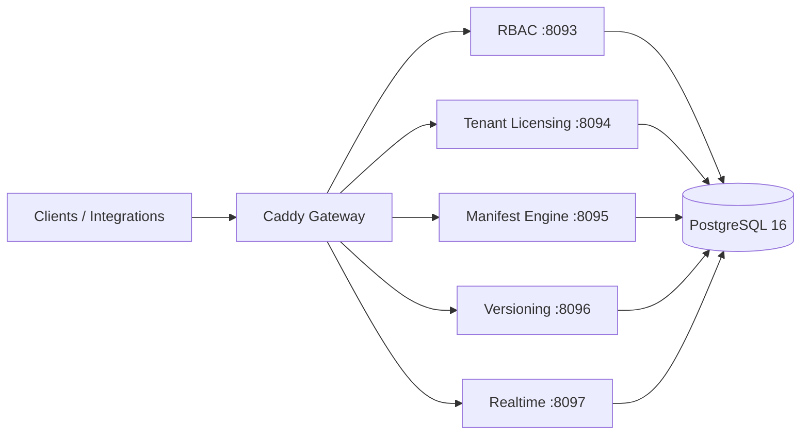

# Maniforge Platform Core

[](https://github.com/Maniforge/Maniforge/actions/workflows/ci-go.yml)
[](https://go.dev/)
[](https://www.postgresql.org/)
[](https://github.com/Maniforge/Maniforge/releases/tag/v0.1.2-box)
[](LICENSE)

**Production Box** — комплект для развёртывания платформы Maniforge **на инфраструктуре заказчика** (on-premise, local-first): API-first backend с multi-tenant RBAC, tenant licensing, Manifest Engine (сущность → REST + OpenAPI), versioning и realtime. Вы клонируете репозиторий на **свой** Ubuntu-сервер, настраиваете секреты и FQDN, запускаете `install-maniforge.sh` — Maniforge **не** хостит ваш production.

| | |
|---|---|
| **Production Box (полная спецификация)** | [`docs/PRODUCTION_BOX.md`](docs/PRODUCTION_BOX.md) |
| Архитектура | [`docs/MANIFORGE_ARCHITECTURE.md`](docs/MANIFORGE_ARCHITECTURE.md) |
| Обзор платформы | [`docs/MANIFORGE_PLATFORM_OVERVIEW.md`](docs/MANIFORGE_PLATFORM_OVERVIEW.md) |
| OpenAPI | [`docs/openapi/`](docs/openapi/) |

**Репозиторий:** [github.com/Maniforge/Maniforge](https://github.com/Maniforge/Maniforge) · ветка **`platform-core`** · релиз **[`v0.1.2-box`](https://github.com/Maniforge/Maniforge/releases/tag/v0.1.2-box)**

---

## Что такое продаваемый деплой (Production Box)

**Production Box** — это готовый к установке комплект платформенного ядра Maniforge для **самостоятельного** развёртывания на сервере. Вы получаете исходный код, скрипты установки и проверки, конфигурацию шлюза и базы данных, а также документацию по эксплуатации. Установка на **вашей** Ubuntu 22.04/24.04 LTS: `git clone` → `cp deploy/.env.platform.server.example deploy/.env.platform` → правка секретов → `install-maniforge.sh --domain <ваш-fqdn>`.

Комплект **не** является облачным SaaS, **не** предполагает хостинг у Maniforge и **не** включает прикладные модули (WMS, supply chain, `.mfpack`) — они поставляются отдельными фазами. Версия **v0.1.2-box** — коммерчески воспроизводимый релиз platform core, публичен на GitHub, готов к передаче DevOps-команде.

---

## Состав комплекта

| Включено | Не включено (v0.1.2-box) |
|----------|--------------------------|
| 5 Go-сервисов platform core (RBAC, Tenant Licensing, Manifest Engine, Versioning, Realtime) | App Store / runtime `.mfpack` |
| PostgreSQL 16 — primary + streaming replica | Модули supply chain (warehouses, WMS, inventory) |
| Caddy gateway (HTTPS по вашему FQDN или staging по IP:18090 на вашем сервере) | Managed SaaS / мульти-тенант хостинг |
| systemd unit-файлы с политикой перезапуска | Полный CI/CD pipeline заказчика |
| Скрипты `install-maniforge.sh`, `verify-maniforge.sh`, upgrade path | PHP reference stack |

Подробности, backup/restore, TLS и post-install checklist — в [`docs/PRODUCTION_BOX.md`](docs/PRODUCTION_BOX.md).

---

## Требования

| Ресурс | Минимум | Рекомендуется (до 50 пользователей) |
|--------|---------|-------------------------------------|
| CPU | 2 vCPU | 4 vCPU |
| RAM | 4 GB | 8 GB |
| Disk | 40 GB SSD | 80 GB SSD |
| OS | Ubuntu 22.04 или 24.04 LTS | то же |
| Сеть | 80, 443 (production) или 18090 (staging без TLS на вашем IP) | статический IP, DNS A-record на ваш FQDN |

Дополнительно на сервере: `git`, `sudo`, доступ в интернет для apt/docker при первой установке.

---

## Установка (greenfield)

Скопируйте блок целиком. Все команды — для чистого сервера Ubuntu.

```bash
git clone --branch platform-core https://github.com/Maniforge/Maniforge.git
cd Maniforge
# или сразу в целевой каталог:
# git clone --branch platform-core https://github.com/Maniforge/Maniforge.git /opt/maniforge/platform-core
# cd /opt/maniforge/platform-core

cp deploy/.env.platform.server.example deploy/.env.platform
# отредактируйте секреты в deploy/.env.platform — не коммитьте этот файл

# Staging без TLS на вашем IP (порт 18090) — опционально до выдачи домена:
sudo bash deploy/scripts/install-maniforge.sh --skip-apt --non-interactive
bash deploy/scripts/verify-maniforge.sh
```

**Production с HTTPS** (DNS A-record вашего FQDN уже указывает на сервер):

```bash
sudo bash deploy/scripts/install-maniforge.sh --domain platform.example.com
bash deploy/scripts/verify-maniforge.sh
```

Скрипт установки **идемпотентен** — повторный запуск безопасен.

---

## Проверка работоспособности

После `verify-maniforge.sh` ожидается: 6/6 systemd active, health всех сервисов через gateway, replica PostgreSQL в состоянии `streaming`.

| Профиль | URL health-check |
|---------|------------------|
| Production (HTTPS) | `https://<customer-fqdn>/rbac/health` |
| Staging на вашем сервере (IP, без TLS) | `http://<ваш-IP>:18090/rbac/health` |

Пример:

```bash
curl -sf https://platform.example.com/rbac/health
# или staging на вашем IP до выдачи TLS:
curl -sf http://203.0.113.10:18090/rbac/health
```

Дополнительно: `make preflight`, `make manifest-journey` — см. [`deploy/README.md`](deploy/README.md).

---

## Состав платформы



| Сервис | Назначение |
|--------|------------|
| **RBAC** | Аутентификация, роли, политики, MFA, audit, 152-ФЗ hooks |
| **Tenant Licensing** | Тенанты, планы, квоты, lifecycle |
| **Manifest Engine** | Сущность → REST API + OpenAPI + UI-заготовки |
| **Versioning** | История изменений сущностей |
| **Realtime** | WebSocket / live-события |

| Слой | Технологии |
|------|------------|
| Runtime | Go 1.25, Fiber |
| БД | PostgreSQL 16 (Docker + streaming replica) |
| Gateway | Caddy (TLS auto или staging :18090) |
| Контракты | OpenAPI YAML |

---

## Документация

| Документ | Содержание |
|----------|------------|
| [`docs/PRODUCTION_BOX.md`](docs/PRODUCTION_BOX.md) | Спецификация Production Box, backup, upgrade |
| [`deploy/README.md`](deploy/README.md) | Операционные команды, server vs local |
| [`docs/MANIFORGE_ARCHITECTURE.md`](docs/MANIFORGE_ARCHITECTURE.md) | Слои, границы сервисов |
| [`docs/MANIFORGE_NEW_USER_WORKFLOW.md`](docs/MANIFORGE_NEW_USER_WORKFLOW.md) | Onboarding администратора |
| [`docs/README.md`](docs/README.md) | Индекс документации |

---

## Поддержка и лицензия

| | |
|---|---|
| GitHub | https://github.com/Maniforge/Maniforge |
| Issues | https://github.com/Maniforge/Maniforge/issues |
| Поддержка | **support@maniforge.ru** |
| Security | **support@maniforge.ru** · [`SECURITY.md`](SECURITY.md) |
| Contributing | [`CONTRIBUTING.md`](CONTRIBUTING.md) |

**Лицензия:** Apache License 2.0 — см. [`LICENSE`](LICENSE).

**Версия:** [`v0.1.2-box`](https://github.com/Maniforge/Maniforge/releases/tag/v0.1.2-box) · ветка `platform-core`

---

## Development

Локальная разработка — в этом же репозитории ([`deploy/README.md`](deploy/README.md) → **Local dev**):

```bash
git clone --branch platform-core https://github.com/Maniforge/Maniforge.git
cd Maniforge
cp deploy/.env.platform.example deploy/.env.platform
make platform-up
make platform-health
make manifest-journey
```

Production-установка — см. [Установка (greenfield)](#установка-greenfield) выше.

