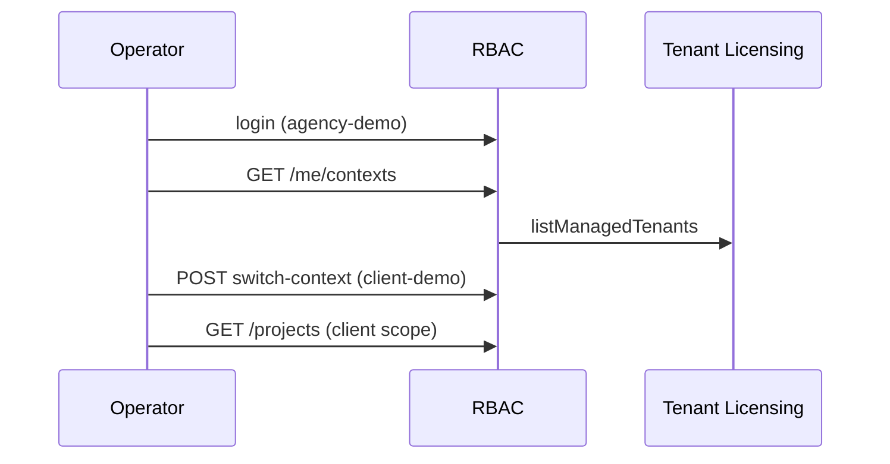

# Бизнес-сценарий: делегирование tenant (agency → client)

Оператор MSP/интегратор работает в home-tenant и переключается в managed-tenant клиента. Сценарий проверен:

- `php maniforge/rbac/tools/delegation_check.php` — CLI (ContextService)
- `php maniforge/rbac/tools/agency_delegation_http_journey.php` — HTTP E2E
- `php maniforge/rbac/tools/business_journeys_suite.php` — полный прогон

## Предварительные условия

```bash
php maniforge/rbac/tools/demo_seed.php
php -S 127.0.0.1:8092 -t public public/index.php
php maniforge/rbac/tools/agency_delegation_http_journey.php
```

Demo-контур:

| Роль | Tenant | Login | Password |
|------|--------|-------|----------|
| Principal (agency) | `agency-demo` / `main` | `agency-admin` | `MANIFORGE_DEMO_ADMIN_PASSWORD` (по умолчанию `DemoAdmin!12345`) |
| Managed (client) | `client-demo` / `main` | `client-admin` | `MANIFORGE_DEMO_USER_PASSWORD` |

Grant: `agency-demo` → `client-demo` (уровень `operator`).

---

## Этап 1. Вход в home-tenant

```http
POST /rbac/api/v1/auth/login
X-Tenant-ID: agency-demo
X-Subtenant-ID: main

{ "login": "agency-admin", "password": "DemoAdmin!12345" }
```

---

## Этап 2. Просмотр доступных контекстов

```http
GET /rbac/api/v1/me/contexts
Authorization: Bearer {access_token}
```

Ответ содержит `home` (собственные tenant) и `delegated` (managed tenants с `grant_level`).

---

## Этап 3. Переключение в managed-tenant

```http
POST /rbac/api/v1/auth/switch-context
Authorization: Bearer {access_token}
X-CSRF-Token: {csrf_token}

{
  "tenant_id": "client-demo",
  "subtenant_id": "main"
}
```

Сессия меняет `tenant_id`/`subtenant_id`; в `GET /me` появляются `kind=delegated`, `delegated=true`, `grant_level`.

---

## Этап 4. Работа в managed scope

После switch-context заголовки `X-Tenant-ID` / `X-Subtenant-ID` должны соответствовать managed-tenant:

```http
GET /rbac/api/v1/projects
GET /rbac/api/v1/me/access
```

---

## Диаграмма



---

## Быстрые команды

```bash
php maniforge/rbac/tools/demo_seed.php
php maniforge/rbac/tools/delegation_check.php
php maniforge/rbac/tools/agency_delegation_http_journey.php
php maniforge/rbac/tools/business_journeys_suite.php
```
