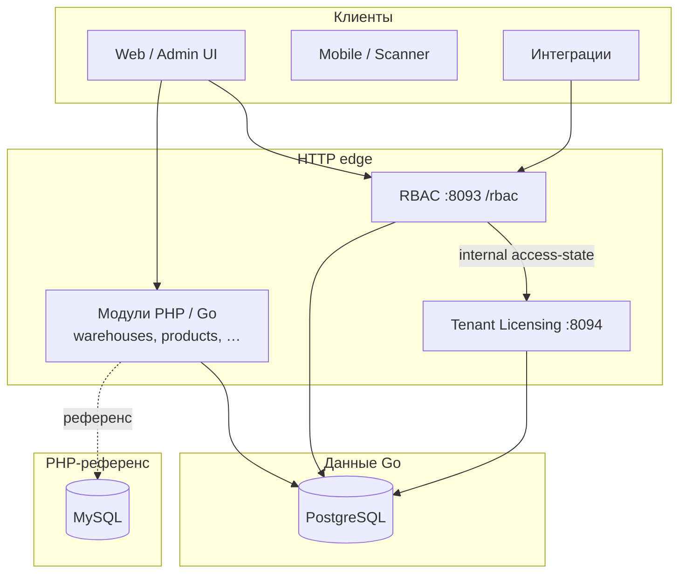

# Maniforge — архитектура платформы

**Статус:** `v1.0-draft` — документ на согласование. После утверждения менять только через ADR (см. §8).

**Иерархия документов:**

| Приоритет | Документ | Роль |
|-----------|----------|------|
| 1 | **Этот файл** | Архитектурные решения, границы сервисов, слои, запреты |
| 2 | [MANIFORGE_PLATFORM_OVERVIEW.md](MANIFORGE_PLATFORM_OVERVIEW.md) | Продукт, модули, бизнес-модель |
| 3 | [MANIFORGE_GLOSSARY.md](MANIFORGE_GLOSSARY.md) | Термины (tenant, workspace, managed tenant, project) |
| 4 | Специализации | Licensing, RBAC, scope, workflows — по ссылкам в §9 |
| — | [MANIFORGE_PRINCIPLES.md](MANIFORGE_PRINCIPLES.md) | Сводный реестр всех принципов (навигация) |

При конфликте между специализацией и этим файлом — **побеждает MANIFORGE_ARCHITECTURE** после согласования v1.0.

---

## 1. Цели архитектуры

1. **API-first** — контракт HTTP/JSON важнее конкретного языка runtime.
2. **Go — основной рантайм**; PHP — референс и регрессия до полного паритета.
3. **Мультитенантность в строках** — одна PostgreSQL (Go), изоляция `tenant_id` + `project_id`.
4. **Security-by-default** — deny-by-default RBAC, licensing gate, разделение identity/profile.
5. **Предсказуемые границы** — сервисы не лезут в чужие таблицы без явного контракта.

---

## 2. Контекст системы



| Сервис | Порт (dev) | Владеет |
|--------|------------|---------|
| RBAC | `:8093` | users, sessions, roles, projects (RBAC), auth API |
| Tenant Licensing | `:8094` | `maniforge_tl_*`, runtime access-state, events |
| Manifest Engine | `:8095` | `maniforge_manifests`, `maniforge_manifest_records`, `/api/data` |
| Realtime | `:8097` | WebSocket hub, live notifications для фронта |
| Доменные модули | свой prefix | доменные таблицы в scope tenant+project |
| migrate | CLI | `migrations/pg/` |

---

## 3. Слои Go-приложения (обязательная структура)

Каждый сервис в `cmd/<name>` + `internal/<name>/`:

```text
cmd/<service>/main.go          # только wiring: config, db, Listen
internal/<service>/app.go      # Fiber, маршруты, middleware
internal/<service>/handler/    # HTTP: parse → service → httpx
internal/<service>/service/    # бизнес-логика, оркестрация
internal/<service>/repository/ # SQL, без бизнес-правил
internal/<service>/security/   # crypto, PII (если нужно)
```

**Запрещено:**

- SQL в `handler` (кроме health ping через `db`).
- HTTP-типы Fiber в `repository`.
- Обход `licensingclient` для runtime-доступа tenant/project.
- Дублирование таблиц TL в RBAC (статус tenant — только через TL).

**Общие пакеты** (`internal/platform/`, `internal/config/`, `internal/db/`):

- без доменной логики;
- переиспользуются всеми сервисами.

Карта файлов: [MANIFORGE_GO_CODEMAP.md](MANIFORGE_GO_CODEMAP.md).

---

## 4. Доменная модель (согласованные оси)

### 4.1. Две независимые оси

| Ось | Смысл | Технически |
|-----|--------|------------|
| **A. Делегирование / сеть** | Оператор, реферал, MSP ведут **другую организацию** | Principal tenant → **Managed tenant** + **Grant** |
| **B. Внутренняя структура** | Отделы, площадки, бренды **внутри одной** организации | Tenant → **Workspace** (`subtenant_id`) → **Project** |

**Жёсткое правило:** `subtenant_id` в API = **workspace (ось B)**, никогда не «клиент» и не «реферальный tenant».

Реферальная «пирамида» = цепочка **отдельных tenant** связанных grant'ами (ось A), не вложенные subtenant.

Подробно: [MANIFORGE_GLOSSARY.md](MANIFORGE_GLOSSARY.md), [MANIFORGE_TENANT_DELEGATION.md](MANIFORGE_TENANT_DELEGATION.md).

### 4.2. Операционный контур данных

```text
tenant_id  +  project_id   ← первичная ось доменных сущностей
subtenant_id               ← маршрут сессии, workspace, видимость
```

Licensing runtime: **`tenant` + `project`** (+ опционально `?workspace=`).  
См. [MANIFORGE_ENTITY_SCOPE.md](MANIFORGE_ENTITY_SCOPE.md), [MANIFORGE_TENANT_LICENSING_SERVICE.md](MANIFORGE_TENANT_LICENSING_SERVICE.md).

### 4.3. Пользователь: identity vs profile

| Таблица | Содержимое | При изменении |
|---------|------------|---------------|
| `maniforge_users` | phone, email, password, mfa, status, login, scope | `security_version++`, **RevokeAllForUser** |
| `maniforge_user_profile` | display_name, avatar, bio, locale, timezone | Сессии **не** рвутся |

API (Go):

- `PATCH /api/v1/me/profile` — мягко
- `PATCH /api/v1/me/identity`, `POST /api/v1/me/change-password` — с logout everywhere

Сессия хранит `security_version_snapshot`; authenticate сравнивает с текущим.

---

## 5. Границы сервисов и контракты

### 5.1. RBAC ↔ Tenant Licensing

| Направление | Контракт |
|-------------|----------|
| RBAC → TL | `GET /internal/v1/tenants/{tenant}/projects/{project}/access-state` |
| TL → RBAC | `POST /internal/v1/tenant-events` (suspend, license revoked → revoke sessions) |
| Токены | `TENANT_LICENSING_INTERNAL_TOKEN`, `RBAC_INTERNAL_TOKEN` — только server-to-server |

Клиент: `internal/licensingclient` — единственная точка runtime-проверки в RBAC.

### 5.2. RBAC ↔ доменные модули

- Модули **не** проверяют пароль; только **Bearer session** + permissions.
- Scope сессии: `tenant_id`, `subtenant_id`, `project_id`.
- Cross-tenant — только grant + switch-context или delegation share на сущности.

### 5.3. Credentials

Три уровня: platform tokens, session (access/refresh), action tokens (reauth).  
См. [MANIFORGE_CREDENTIAL_ARCHITECTURE.md](MANIFORGE_CREDENTIAL_ARCHITECTURE.md).

---

## 6. Два runtime-контура

| | Go (основной) | PHP (референс) |
|---|---------------|----------------|
| Код | `cmd/`, `internal/` | `app/Maniforge/`, `maniforge/` |
| БД | PostgreSQL `migrations/pg/` | MySQL `maniforge/rbac/migrations/` |
| Эталон при портировании | Целевой | Поведение + journey-тесты до паритета |
| Удаление PHP | После паритета API и e2e на Go | — |

Порядок портирования: [MANIFORGE_GO_MIGRATION.md](MANIFORGE_GO_MIGRATION.md).

**Правило паритета:** JSON-поля и HTTP-коды 1:1 с OpenAPI / PHP journey.

---

## 7. Безопасность (сквозные требования)

| Требование | Реализация |
|------------|------------|
| Пароли | Argon2id (новые), verify bcrypt legacy |
| PII | Blind index phone; AES-GCM optional (`RBAC_PII_*`) |
| Сессии | Hash token в БД; rotation refresh; revoke reasons |
| Admin | reauth + action token для чувствительных операций |
| Audit | `maniforge_audit_log`, versioning с redact PII |
| Headers | `SecurityHeaders` middleware на всех Fiber-сервисах |

Детали: [MANIFORGE_ENTERPRISE_HARDENING.md](MANIFORGE_ENTERPRISE_HARDENING.md), [152FZ_COMPLIANCE.md](152FZ_COMPLIANCE.md).

---

## 8. Процесс изменения архитектуры

После согласования `v1.0` любое **архитектурное** изменение:

1. Добавить запись **ADR** в `docs/adr/NNNN-краткое-имя.md` (шаблон ниже).
2. Обновить **этот файл** (§9 ADR index + затронутые §).
3. Обновить глоссарий / специализации при смене терминов.
4. Обновить [MANIFORGE_GO_CODEMAP.md](MANIFORGE_GO_CODEMAP.md) при новых пакетах.
5. PR не мержить без пункта «Architecture impact: yes/no».

### Шаблон ADR

```markdown
# ADR-NNNN: Заголовок
- Статус: proposed | accepted | deprecated
- Дата: YYYY-MM-DD
## Контекст
## Решение
## Последствия
## Альтернативы (отклонённые)
```

### Утверждение v1.0

| Роль | Имя | Дата | Статус |
|------|-----|------|--------|
| Владелец продукта | _заполнить_ | | pending |
| Tech lead | _заполнить_ | | pending |

После заполнения таблицы сменить статус документа на `v1.0-approved`.

---

## 9. Реестр архитектурных решений (ADR)

| ID | Решение | Статус |
|----|---------|--------|
| ADR-0001 | Go — основной runtime; PHP — референс | accepted |
| ADR-0002 | Изоляция данных: `tenant_id` + `project_id`; subtenant = workspace | accepted |
| ADR-0003 | Managed client = отдельный tenant + grant, не subtenant | accepted |
| ADR-0004 | Licensing на tenant; runtime check tenant + project | accepted |
| ADR-0005 | `users` vs `user_profile`; identity change → revoke all sessions | accepted |
| ADR-0006 | Слои handler → service → repository в Go | accepted |
| ADR-0007 | TL — source of truth для лицензий; RBAC через licensingclient | accepted |
| ADR-0008 | Manifest Engine MVP | accepted |
| ADR-0009 | Control/data plane; manifest origin platform/custom; field type catalog | accepted |

Полные тексты ADR — в `docs/adr/` (создавать по мере необходимости; индекс дублируется здесь).

---

## 10. Чеклист для нового кода (Go)

Перед merge проверить:

- [ ] Файл имеет заголовок (см. `.cursor/rules/go-file-documentation.mdc`)
- [ ] Нет SQL в handler; бизнес-логика в service
- [ ] Tenant/project scope не смешан с managed-tenant delegation
- [ ] Изменение `maniforge_users` идёт через security path с revoke
- [ ] Профиль — только `maniforge_user_profile`
- [ ] Runtime access — через `licensingclient`, не прямой SELECT TL
- [ ] Добавлен/обновлён `MANIFORGE_GO_CODEMAP.md`
- [ ] Архитектурное изменение → ADR

---

## 11. Связанные документы

| Тема | Файл |
|------|------|
| Принципы (сводка) | [MANIFORGE_PRINCIPLES.md](MANIFORGE_PRINCIPLES.md) |
| Термины | [MANIFORGE_GLOSSARY.md](MANIFORGE_GLOSSARY.md) |
| Scope данных | [MANIFORGE_ENTITY_SCOPE.md](MANIFORGE_ENTITY_SCOPE.md) |
| Delegation | [MANIFORGE_TENANT_DELEGATION.md](MANIFORGE_TENANT_DELEGATION.md) |
| Licensing | [MANIFORGE_TENANT_LICENSING_SERVICE.md](MANIFORGE_TENANT_LICENSING_SERVICE.md) |
| Credentials | [MANIFORGE_CREDENTIAL_ARCHITECTURE.md](MANIFORGE_CREDENTIAL_ARCHITECTURE.md) |
| Go-миграция | [MANIFORGE_GO_MIGRATION.md](MANIFORGE_GO_MIGRATION.md) |
| Карта Go-файлов | [MANIFORGE_GO_CODEMAP.md](MANIFORGE_GO_CODEMAP.md) |
| Модули | [MANIFORGE_PLATFORM_OVERVIEW.md](MANIFORGE_PLATFORM_OVERVIEW.md) §3.3 |
