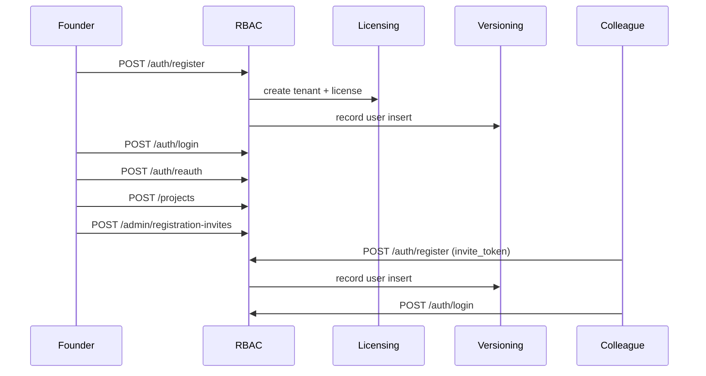

# Бизнес-сценарий: работа нового пользователя в Maniforge

Этот документ описывает типичный путь **нового клиента** — от регистрации до совместной работы команды. Сценарий проверен автотестами:

- `php maniforge/rbac/tools/entity_meta_check.php` — реестр `maniforge_entity_meta`, PublicUserPayload, дубликат телефона
- `php maniforge/rbac/tools/new_user_journey_check.php` — CLI, сервисный слой (entity_meta, contexts, invite 409, отказ login-only)
- `php maniforge/rbac/tools/new_user_http_journey.php` — HTTP API (нужен запущенный сервер)
- `php maniforge/rbac/tools/race_condition_check.php` — проверка конкурентного доступа
- `php maniforge/rbac/tools/new_user_suite.php` — запуск всех проверок подряд

## Предварительные условия

```bash
# 1. Миграции и preflight
php maniforge/rbac/tools/migrate.php
php maniforge/rbac/tools/preflight.php

# 2. Запуск приложения
php -S 127.0.0.1:8092 -t public public/index.php

# 3. Прогон сценария
php maniforge/rbac/tools/new_user_suite.php
```

Базовые URL модулей:

| Модуль | Prefix |
|--------|--------|
| RBAC | `http://127.0.0.1:8092/rbac` |
| Tenant Licensing | `http://127.0.0.1:8092/tenant-licensing` |
| Versioning | `http://127.0.0.1:8092/versioning` |

---

## Этап 1. Регистрация организации (новый tenant)

**Бизнес-задача:** основатель компании создаёт workspace, получает лицензию и роль `tenant_admin`.

```http
POST /rbac/api/v1/auth/register
Content-Type: application/json

{
  "password": "SecurePassword!12345",
  "phone": "+79001234567",
  "email": "founder@company.example",
  "organization_name": "Acme Corp",
  "consents": [
    { "purpose_code": "account", "policy_version": "1.0" }
  ]
}
```

> Перед регистрацией: `GET /rbac/api/v1/privacy/notice` (цели и оператор). При `RBAC_PD_REGISTER_CONSENT_REQUIRED=true` обязательны согласия для всех целей с `is_mandatory_for_registration`. См. `docs/152FZ_COMPLIANCE.md`.

**Что происходит внутри:**

1. Создаётся tenant + subtenant `main` в Tenant Licensing
2. Назначается plan `starter` и active license
3. Создаётся пользователь с ролью `tenant_admin`; связь телефон ↔ user в `maniforge_entity_meta` (`type=phone`, `i_index=1`). Внутренний login в API не передаётся и не возвращается.
4. Запись попадает в audit log и versioning (`maniforge_users`)

**Ответ (201):**

```json
{
  "ok": true,
  "user": { "id": 42, "phone": "+79001234567", ... },
  "role_code": "tenant_admin",
  "tenant": {
    "tenant_id": "t-a1b2c3d4",
    "subtenant_id": "main",
    "plan_code": "starter"
  }
}
```

> Нельзя указать чужой `tenant_id` / `subtenant_id` напрямую — подключение к существующему workspace только по invite.  
> Повторная саморегистрация на уже занятый телефон → **409** `phone_already_registered`. Управление организациями — в профиле (`GET /me/contexts`, переключение `POST /auth/switch-context`).

---

## Этап 2. Вход в систему

**Бизнес-задача:** пользователь входит по телефону (без знания tenant_id).

```http
POST /rbac/api/v1/auth/login
Content-Type: application/json
X-Tenant-ID: t-a1b2c3d4
X-Subtenant-ID: main

{
  "phone": "+79001234567",
  "password": "SecurePassword!12345"
}
```

**Ответ:** `access_token`, `refresh_token`, `csrf_token`, данные сессии.

Дальнейшие запросы:

```http
Authorization: Bearer {access_token}
X-CSRF-Token: {csrf_token}
X-Tenant-ID: t-a1b2c3d4
X-Subtenant-ID: main
```

---

## Этап 3. Step-up перед изменениями

При `RBAC_ADMIN_REQUIRE_STEP_UP=true` (по умолчанию) мутации требуют подтверждения пароля:

```http
POST /rbac/api/v1/auth/reauth
Authorization: Bearer {access_token}
X-CSRF-Token: {csrf_token}

{ "password": "SecurePassword!12345" }
```

В ответе — `credentials.action.action_token`. Его передают в заголовке:

```http
X-Action-Token: {action_token}
```

---

## Этап 4. Создание проекта и переменных

**Бизнес-задача:** tenant_admin заводит первый проект и настраивает переменные окружения.

```http
POST /rbac/api/v1/projects
Authorization: Bearer ...
X-CSRF-Token: ...
X-Action-Token: ...

{
  "code": "mobile-app",
  "name": "Mobile App",
  "metadata": { "env": "dev" }
}
```

```http
POST /rbac/api/v1/global-variables
...

{
  "key": "api_base_url",
  "value": "https://api.example.com",
  "scope_level": "subtenant"
}
```

Изменения фиксируются в `/versioning/api/v1/changes`.

---

## Этап 5. Приглашение коллеги

**Бизнес-задача:** admin приглашает разработчика в тот же subtenant.

```http
POST /rbac/api/v1/admin/registration-invites
Authorization: Bearer ...
X-CSRF-Token: ...
X-Action-Token: ...

{
  "invite_type": "user",
  "role_code": "user",
  "reason": "onboarding developer"
}
```

Ответ содержит `invite_token` и `register_url`.

**Новый сотрудник** (телефон ещё не в системе):

```http
POST /rbac/api/v1/auth/register

{
  "password": "DevPassword!12345",
  "phone": "+79007654321",
  "invite_token": "{invite_token}"
}
```

**Уже есть аккаунт в другой компании** (как на WB — тот же телефон и пароль, без новой регистрации):

```http
POST /rbac/api/v1/auth/register

{
  "password": "Тот_же_пароль",
  "phone": "+79007654321",
  "invite_token": "{invite_token}",
  "consents": [{ "purpose_code": "account", "policy_version": "1.0" }]
}
```

Ответ: `attached: true`, новая учётка в scope организации, тот же пароль работает при login.

**Или** пользователь уже вошёл:

```http
POST /rbac/api/v1/auth/accept-invite
Authorization: Bearer …

{ "invite_token": "{invite_token}" }
```

**Админ** может прикрепить по телефону без ссылки:

```http
POST /rbac/api/v1/admin/organization-members
Authorization: Bearer …

{
  "phone": "+79007654321",
  "role_code": "moderator",
  "reason": "Доступ к кабинету поставщика"
}
```

Роль по умолчанию — `user`. Invite одноразовый. После привязки организации видны в `GET /me/contexts`.

---

## Этап 6. Проверка лицензии и доступа

Platform / internal контур:

```http
GET /tenant-licensing/internal/v1/tenants/{tenant}/subtenants/main/access-state
```

Пользовательский контур — через login (RBAC проверяет license enforcement).

---

## Этап 7. Аудит и история

| Что смотреть | API |
|--------------|-----|
| Аудит RBAC | `GET /rbac/api/v1/admin/audit` |
| История изменений | `GET /versioning/api/v1/changes?entity_table=maniforge_projects` |
| Реестр сущностей | `GET /versioning/api/v1/registry` |

---

## Диаграмма потока



---

## Race condition: что проверено

| Область | Механизм | Результат теста |
|---------|----------|-----------------|
| Rate limit | `SELECT ... FOR UPDATE` в транзакции | Атомарно, 12 параллельных инкрементов → count=12 |
| License assign | Транзакция: revoke active + insert | Только 1 active license после 8 параллельных assign |
| Invite register | read invite → create user → mark consumed | **WARN:** при одновременном запросе возможны 2 успешные регистрации по одному invite |
| Login brute-force | read-then-update без блокировки | **INFO:** возможен under-count при параллельных failed login |

Рекомендация для production: обернуть `registerViaInvite` в транзакцию с `SELECT ... FOR UPDATE` на строке invite до создания пользователя.

---

## Быстрые команды

```bash
# Только CLI-сценарий (без HTTP-сервера)
php maniforge/rbac/tools/new_user_journey_check.php

# HTTP E2E (сервер должен быть запущен)
php maniforge/rbac/tools/new_user_http_journey.php

# Race conditions
php maniforge/rbac/tools/race_condition_check.php

# Всё вместе
php maniforge/rbac/tools/new_user_suite.php

# Включено в общий прогон CI
php maniforge/rbac/tools/check_all.php
```
