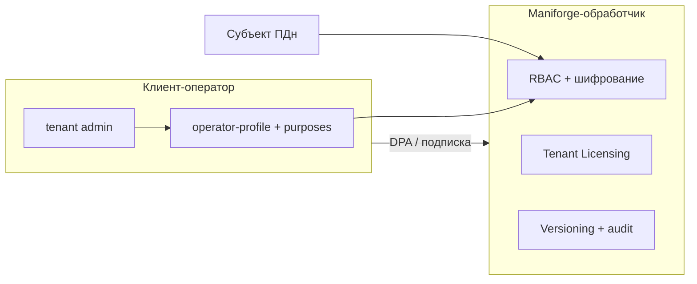

# Maniforge как платформа-обработчик ПДн (SaaS по подписке)

Целевая модель: **клиенты по подписке** получают изолированный tenant, сами выступают **операторами ПДн** своих пользователей; **Maniforge** — **обработчик по поручению** (ст. 6 152-ФЗ), обеспечивает шифрование, изоляцию, аудит и API прав субъекта. Прикладные модули подключаются поверх этого контура без повторного проектирования compliance.

## Роли (юридически и в продукте)

| Роль | Кто | В системе | Обязанности |
|------|-----|-----------|-------------|
| **Оператор ПДн** | Клиент (юрлицо по подписке) | `maniforge_pd_operator_profiles` на `tenant_id` клиента | Цели, политика, согласия, ответы субъектам, уведомление РКН (если требуется) |
| **Обработчик ПДн** | Владелец Maniforge (вы) | `RBAC_PLATFORM_PROCESSOR_*` в env + DPA | Ст. 19: меры защиты, хостинг в РФ, обработка только по инструкции оператора |
| **Субъект** | Пользователь клиента | `maniforge_users` в scope tenant | Ст. 14 через API |
| **Субобработчик** | Хостинг, почта, мониторинг | Договор + реестр в DPA | Уведомление оператора |

Схема:



## Что уже даёт «фундамент» (не переписывать в каждом модуле)

| Слой | Компонент | Для модулей |
|------|-----------|-------------|
| **Коммерция** | Tenant Licensing: plan, license, seats, suspend | Подписка = активный tenant + лимиты |
| **Изоляция** | `tenant_id` + `subtenant_id` во всех таблицах | Данные модуля только в scope |
| **Доступ** | RBAC permissions, delegated grant | Модуль объявляет коды прав в seed |
| **ПДн** | purposes, consents, notice, subject-requests | Модуль добавляет цель `code` в purposes |
| **Защита** | PII AES-256-GCM, audit sanitizer, versioning redact | Email/phone через RBAC users |
| **Жизненный цикл** | retention, erasure, audit export | Cron `pd_retention_enforce.php` |
| **След** | audit_log, security_events, versioning | События модуля в том же tenant scope |

Подключение нового модуля (чеклист разработчика):

1. Все таблицы с `tenant_id` / `subtenant_id`; без кросс-tenant запросов.
2. Новые permissions → миграция seed + проверка в `Router`.
3. Новые цели ПДн → `POST .../admin/personal-data/purposes` или seed при bootstrap (описать категории ПДн).
4. Мутации только при валидной сессии; чувствительное — step-up reauth.
5. PII не дублировать в открытом виде; при необходимости — ссылка на `maniforge_users`.
6. Документировать API в OpenAPI / `templates/data/api-docs/`.

## Онбординг клиента по подписке

| Шаг | Кто | Действие |
|-----|-----|----------|
| 1 | Platform | `POST` Tenant Licensing: tenant, subtenant, plan, license |
| 2 | Platform | `php maniforge/rbac/tools/pd_bootstrap_compliance.php {tenant_id} "{Название клиента}"` |
| 3 | Клиент | `PUT /api/v1/admin/personal-data/operator-profile` (ИНН, DPO, URL политики) |
| 4 | Юрист | Подписан DPA (`docs/legal/DATA_PROCESSING_AGREEMENT_OUTLINE.md`); platform: `metadata.dpa_signed_at` на tenant |
| 4b | Platform | `PATCH /tenant-licensing/api/v1/tenants/{code}` body: `{"metadata":{"dpa_signed_at":"2026-06-03T12:00:00Z","dpa_contract_ref":"..."}}` |
| 5 | Клиент | Цели обработки (дефолт account/support + цели модулей) |
| 6 | Клиент | Публикация политики на своём URL → `privacy_policy_url` |
| 7 | Клиент | Уведомление РКН (если применимо); `roskomnadzor_notified_at` в API |
| 8 | Platform | Prod: `RBAC_PD_REGISTER_CONSENT_REQUIRED=true`, PII encryption, cron retention |

При **саморегистрации** tenant (`RegistrationService`) PD bootstrap вызывается автоматически — клиенту остаётся заполнить профиль оператора и политику.

## Ваша ответственность как обработчика (один раз + эксплуатация)

**Один раз (платформа):**

- [ ] Реквизиты обработчика в `RBAC_PLATFORM_PROCESSOR_*`
- [ ] DPA-шаблон и оферта SaaS
- [ ] Хостинг БД и приложения в РФ (документально)
- [ ] Ключи шифрования в KMS / secret store (не в git)
- [ ] Модель угроз и акт классификации ИСПДн **платформы** (архив)
- [ ] Регламент инцидентов (`MANIFORGE_SECURITY_INCIDENT_WORKFLOW.md`)

**На каждого платящего клиента:**

- [ ] Активная лицензия + bootstrap PD
- [ ] Подписан DPA (метаданные)
- [ ] Клиент заполнил operator-profile и опубликовал политику

**РКН:** уведомление подаёт **оператор** (клиент) в отношении своих субъектов; в сведениях указывается поручение Maniforge как обработчику. Отдельное уведомление Maniforge — для ПДн **сотрудников Maniforge** и собственных контуров (сайт, биллинг), не за подмену клиента.

## Production profile обработчика

```dotenv
APP_ENV=production
TENANCY_MODE=multi
TENANT_LICENSING_ENFORCEMENT=strict

# Идентичность обработчика (в privacy notice и DPA)
RBAC_PLATFORM_PROCESSOR_NAME=ООО «…»
RBAC_PLATFORM_PROCESSOR_INN=0000000000
RBAC_PLATFORM_PROCESSOR_ADDRESS=…
RBAC_PLATFORM_PROCESSOR_DPO_EMAIL=dpo@…
RBAC_PLATFORM_DPA_URL=https://…/legal/dpa

# Меры ст. 19
RBAC_PD_REGISTER_CONSENT_REQUIRED=true
RBAC_PII_ENCRYPTION_ENABLED=true
RBAC_PII_ENCRYPTION_KEY=<base64-32-bytes>
RBAC_AUDIT_RETENTION_DAYS=365
RBAC_PD_DPA_REQUIRED=true
RBAC_PD_DPA_EXEMPT_TENANTS=demo
```

API tenant admin:

- `GET /api/v1/admin/personal-data/compliance-status` — чеклист готовности
- `POST /api/v1/admin/personal-data/dpa-acknowledge` — подтверждение DPA клиентом
- `PUT /api/v1/admin/personal-data/operator-profile` — профиль оператора

Проверки:

```bash
php maniforge/rbac/tools/preflight.php
php maniforge/rbac/tools/pd_compliance_check.php
php maniforge/rbac/tools/pd_compliance_journey_check.php
php maniforge/rbac/tools/integration_check.php
```

## Дорожная карта до «полностью готово»

| Приоритет | Задача | Статус |
|-----------|--------|--------|
| P0 | Prod env + encryption + bootstrap всех tenants | Эксплуатация |
| P0 | DPA + политика клиента на проде | Юридически |
| P1 | `processor` в `GET /privacy/notice` | Готово |
| P1 | `dpa_signed_at` в tenant metadata + блок login в prod | Готово |
| P1 | Онбординг operator-profile в RBAC Admin | Готово |
| P2 | Per-tenant CMK (отдельный ключ шифрования) | Бэклог |
| P2 | UI кабинета субъекта | Готово (базовый `/profile`) |
| P2 | Acceptance DPA при регистрации + acknowledge API | Готово |

## Связанные документы

- [152FZ_COMPLIANCE.md](./152FZ_COMPLIANCE.md) — техкарта статей закона
- [DATA_PROCESSING_AGREEMENT_OUTLINE.md](./legal/DATA_PROCESSING_AGREEMENT_OUTLINE.md) — DPA
- [MANIFORGE_ENTERPRISE_HARDENING.md](./MANIFORGE_ENTERPRISE_HARDENING.md) — production gates
- [MANIFORGE_TENANT_DELEGATION.md](./MANIFORGE_TENANT_DELEGATION.md) — партнёры и managed tenants
- [MANIFORGE_NEW_USER_WORKFLOW.md](./MANIFORGE_NEW_USER_WORKFLOW.md) — регистрация и согласия
