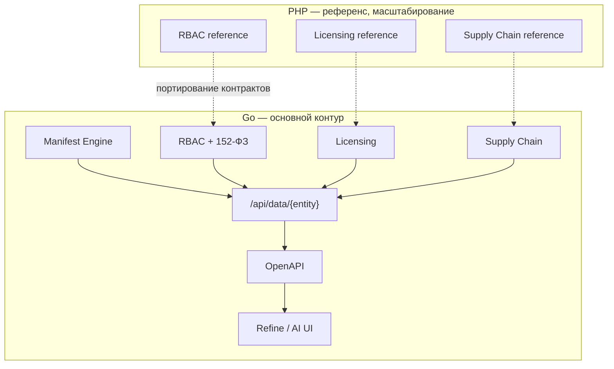

# Maniforge — описание платформы

Единый документ о продукте и модулях.  
**Архитектурные решения (слои, границы сервисов, ADR):** [MANIFORGE_ARCHITECTURE.md](MANIFORGE_ARCHITECTURE.md) — после согласования v1.0 имеет приоритет над специализациями.  
При расхождении с кодом — исправлять код или ADR, не «тихо» менять поведение.

---

## 1. Название и суть

| Термин | Значение |
|--------|----------|
| **Maniforge** | Бренд платформы |
| **Maniforge** | Текущий продукт: модульный SaaS-конструктор (`templates/data/branding.php`) |
| **Maniforge Modular Constructor** | Подзаголовок на лендинге |
| **Manifest Engine** | Ключевая инновация на Go: описание сущности → API + UI без кода |
| **PHP-контур** | Референсная реализация, сохранена отдельно для масштабирования и миграции |

**Сейчас:** Maniforge — API-first платформа. **Основной язык разработки и рантайм — Go (Fiber).** Бизнес-логика, контракты и journey-тесты проверены в **PHP-референсе** (`app/Maniforge/*`, `maniforge/*`); этот контур **не выбрасывается**, а хранится параллельно для горизонтального масштабирования, поэтапной миграции клиентов и отказоустойчивости.

**Manifest Engine** (на Go) — клиент описывает сущность (**Manifest**), платформа генерирует REST API, field-level эндпоинты, OpenAPI и UI. Ядро продукта строится на Go; PHP остаётся референсом и опциональным runtime-слоем.

> Maniforge — не low-code «для бизнес-пользователя». Это **API-движок** для разработчиков, интеграторов и технических предпринимателей: конфигурация и модули вместо ручной разработки бэкенда с нуля.

**Философия:** Lego-кубики (tenant, RBAC, модули, в перспективе — манифесты), из которых собирается сервис с полным контролем над API и данными.

---

## 2. Терминология (обязательно к прочтению)

Коллизия №1 в проекте — путаница **subtenant** и **клиент**. Подробно: [MANIFORGE_GLOSSARY.md](MANIFORGE_GLOSSARY.md).

| Ось | Вопрос | Сущность Maniforge |
|-----|--------|--------------|
| **A. Делегирование** | Оператор ведёт клиента как отдельную организацию? | **Principal tenant** → **Managed tenant** + **Grant** |
| **B. Внутренняя структура** | Как делим одну организацию на отделы? | **Subtenant (workspace)** + **Project** внутри **одного** tenant |

**Правила без коллизий:**

- `subtenant_id` в API — **workspace**, никогда не «клиент-организация».
- Клиент оператора — **managed tenant** (отдельный `maniforge_tl_tenants.code`), не subtenant principal.
- Данные модулей: ось **`tenant_id` + `project_id`**; `subtenant_id` — маршрут сессии и видимость. См. [MANIFORGE_ENTITY_SCOPE.md](MANIFORGE_ENTITY_SCOPE.md).
- Исторический документ [NILZYAGRAM_MICROSERVICE.md](NILZYAGRAM_MICROSERVICE.md) — ТЗ, из которого вырос `maniforge/rbac`; в эксплуатации используйте **Maniforge RBAC**, не «Нильзяграм».

---

## 3. Два контура: Go (основной) и PHP (референс)

| | **Go-контур** | **PHP-контур** |
|---|---------------|----------------|
| **Роль** | Основной язык, продакшн-рантайм, Manifest Engine | Референсная реализация, сохранена отдельно |
| **Зачем PHP** | — | Проверенные контракты, journey-тесты, поэтапная миграция клиентов, горизонтальное масштабирование (отдельные PHP-ноды / legacy-сервисы) |
| **Код** | `cmd/`, `internal/` — см. [MANIFORGE_GO_MIGRATION.md](MANIFORGE_GO_MIGRATION.md) | `app/Maniforge/*`, `maniforge/*/public/` |
| **Статус модулей** | Портирование + Manifest Engine | ✅ RBAC, Licensing, Supply Chain |

Оба контура используют **одну PostgreSQL**, общие контракты API и терминологию из глоссария. При расхождении поведения — эталоном для миграции служит PHP-референс до полного паритета на Go.

### 3.1. Технологический стек

| Компонент | Go (основной) | PHP (референс) | Общее / roadmap |
|-----------|---------------|----------------|-----------------|
| Бэкенд | **Go + Fiber** | PHP 8, модули `app/Maniforge/*` | Одинаковые REST-контракты |
| БД | **PostgreSQL 15+** (`migrations/pg/`) | **MySQL** (референс, `maniforge/rbac/migrations/`) | Разные БД до cutover; общие контракты таблиц |
| Кэш / очереди | Redis, RabbitMQ | — | Вебхуки, фоновые задачи |
| Фронтенд | React + Refine / AI UIGen | PHP-шаблоны (`templates/`) | Стратегия: [MANIFORGE_UI_STRATEGY.md](MANIFORGE_UI_STRATEGY.md) |
| OpenAPI | Автогенерация на Manifest + YAML модулей | RBAC, Licensing (YAML); supply chain — `/api` | Единая спецификация |
| Тесты | Go test + e2e | Journey `maniforge/rbac/tools/*`, `check_all.php` | PHP-тесты — регрессия при портировании |

### 3.2. Мультитенантность (факт)

- **Изоляция данных:** строки в общих таблицах с `tenant_id` + `subtenant_id` (не отдельная схема PostgreSQL на тенанта).
- **Коммерческий lifecycle:** Tenant Licensing (`maniforge_tl_*`) — source of truth для статуса tenant, планов, лицензий, квот. См. [MANIFORGE_TENANT_LICENSING_SERVICE.md](MANIFORGE_TENANT_LICENSING_SERVICE.md).
- **Cross-tenant доступ:** только через **grant** (delegation) или **delegation share** на сущностях. См. [MANIFORGE_TENANT_DELEGATION.md](MANIFORGE_TENANT_DELEGATION.md).

### 3.3. Каталог модулей

Каждый модуль — отдельный HTTP-префикс, health, API в tenant scope. Каталог на главной: `templates/data/maniforge-modules.php`.

Статус в таблице: **PHP** — референс в репозитории; **Go** — порт / новая разработка.

#### Платформа

| Модуль | Prefix | PHP (референс) | Go (основной) | Документация |
|--------|--------|----------------|---------------|--------------|
| **RBAC** | `/rbac` | ✅ | 🔁 портирование | [MANIFORGE_RBAC_CHECKPOINT_SUMMARY.md](MANIFORGE_RBAC_CHECKPOINT_SUMMARY.md) |
| **Tenant Licensing** | `/tenant-licensing` | ✅ | 🔁 портирование | [MANIFORGE_TENANT_LICENSING_SERVICE.md](MANIFORGE_TENANT_LICENSING_SERVICE.md) |
| **Versioning** | `/versioning` | ✅ | 🔁 портирование | Audit trail по tenant scope |
| **Manifest Engine** | `/api/data` | — | ✅ фазы 0–6 | См. §4 |

#### Supply Chain

| Модуль | Prefix | PHP (референс) | Go (основной) | Документация |
|--------|--------|----------------|---------------|--------------|
| **Warehouses** | `/warehouses` | ✅ | 🔁 портирование | [MANIFORGE_WAREHOUSES.md](MANIFORGE_WAREHOUSES.md) |
| **Products** | `/products` | ✅ | 🔁 портирование | [MANIFORGE_PRODUCTS.md](MANIFORGE_PRODUCTS.md) |
| **Inventory** | `/inventory` | ✅ | 🔁 портирование | [MANIFORGE_INVENTORY.md](MANIFORGE_INVENTORY.md) |
| **WMS** | `/wms` | ✅ | 🔁 портирование | [MANIFORGE_WMS.md](MANIFORGE_WMS.md) |

Обзор цепочки: [MANIFORGE_SUPPLY_CHAIN_MODULES.md](MANIFORGE_SUPPLY_CHAIN_MODULES.md). Аудит: [MANIFORGE_SUPPLY_CHAIN_AUDIT.md](MANIFORGE_SUPPLY_CHAIN_AUDIT.md).

```text
Warehouses (stock) + Products (SKU)
        ↓
WMS: КИЗ → group → pallet (SSCC/QR)
        ↓
maniforge_inv_balances ← maniforge_inv_movements
```

### 3.4. Безопасность и 152-ФЗ

Реализовано в **PHP-референсе**; переносится в Go с сохранением контрактов.

| Слой | Реализация |
|------|------------|
| Auth | login, refresh, step-up, CSRF, lockout, session revoke |
| RBAC | roles + permissions, policy rules, deny-by-default |
| ПДн | Оператор = клиент-tenant, Maniforge = обработчик. Профили, согласия, subject-requests |
| Шифрование | AES-256-GCM для email/phone (`PiiFieldCodec`) |
| Audit | `maniforge_audit_log`, `maniforge_security_events`, versioning с redact PII |
| Delegation | `read_only` / `operator` / `admin` grant levels |

Документы: [152FZ_COMPLIANCE.md](152FZ_COMPLIANCE.md), [MANIFORGE_PD_PROCESSOR_PLATFORM.md](MANIFORGE_PD_PROCESSOR_PLATFORM.md), [MANIFORGE_ENTERPRISE_HARDENING.md](MANIFORGE_ENTERPRISE_HARDENING.md), [MANIFORGE_CREDENTIAL_ARCHITECTURE.md](MANIFORGE_CREDENTIAL_ARCHITECTURE.md).

### 3.5. Интеграции и метаданные

- **entity_meta** — связь внутренних ID с внешними ключами (телефон, в будущем Wildberries). См. [ENTITY_META.md](ENTITY_META.md).
- Модули **Wildberries / Ozon / чат** — в бэклоге, не в репозитории.

### 3.6. Чего нет в Go-контуре (не описывать как готовое на Go)

| Возможность | PHP-референс | Go (основной) |
|-------------|--------------|---------------|
| RBAC, Licensing, Supply Chain | ✅ | 🔁 портирование |
| Manifest CRUD (`manifests`, `manifest_records`) | — | ✅ |
| `/api/data/{entity}` + field-level | — | ✅ |
| Field-level permissions (`read_roles` / `write_roles`) | — | ✅ |
| Audit log + licensing gate + archive manifest | — | ✅ |
| Versioning записей (`maniforge_ver_changes`) | — | ✅ |
| JSONB filter + pagination meta + OpenAPI YAML | — | ✅ |
| Refine UI scaffold + браузерный `/refine-manifest` | — | ✅ |
| Supply chain presets (product, stock) | — | ✅ |
| Автогенерация UI (Refine / AI) | — | ✅ scaffold / AI roadmap |
| Токен-методика (оплата за API-запрос) | — | 🚧 roadmap |
| Схема PostgreSQL на тенанта / отдельная БД | — | 🚧 Enterprise |

В PHP слово `manifest` встречается только в **audit export** (`manifest_sha256` — хеш выгрузки), не в смысле Manifest Engine.

---

## 4. Архитектура Manifest Engine (Go)

Ядро платформы на **Go**. RBAC, licensing, 152-ФЗ и supply chain **портируются** с PHP-референса; поверх — динамические манифесты.

| Принцип | Реализация (Go) |
|---------|-----------------|
| **API-first** | Все возможности через REST; OpenAPI на каждый манифест |
| **Manifest** | Поля, типы, валидация, права → таблица + CRUD API |
| **Field-level API** | `PUT /api/data/{entity}/{id}/{field}`; JSONB и массивы, напр. `.../variants/0/price` |
| **Field-level permissions** | `read_roles` / `write_roles` в манифесте |
| **UI-генерация** | Refine из OpenAPI; AI-генератор; выгрузка React-кода |
| **Модульность** | Готовые модули = пресеты манифестов + UI (WMS, WB, Ozon) |
| **Масштабирование** | Горизонтальные Go-сервисы + опционально PHP-ноды референса; шардирование БД |



Модули supply chain в PHP — **закодированные доменные сервисы** (эталон поведения). На Go: сначала паритет API, затем описание как пресетов манифестов. PHP-контур остаётся для legacy-клиентов и burst-масштабирования без остановки Go-ядра.

---

## 5. Бизнес-модель

### 5.1. Тарифы (реализовано в Tenant Licensing)

Источник: `templates/data/product-plans.php`, `demo_seed.php`.  
**Не использовать** устаревшие названия Sandbox / Pro — в коде их нет.

| Plan code | Название | Назначение |
|-----------|----------|------------|
| `free` | Free | 1 tenant, 0 subtenants, до 10 users |
| `starter` | Starter | Пилот: 1 tenant, 1 subtenant, до 25 users |
| `business` | Business | Рост: несколько subtenants, до 250 users, квоты |
| `enterprise` | Enterprise | Production: strict licensing, MFA, PII encryption |
| `operator` | Operator | Principal-оператор: `max_tenants` (managed clients), до 25 в demo |

Лимиты задаются в `limits_json` плана (`max_users`, `max_sessions`, `max_subtenants`, `max_tenants`).

### 5.2. Монетизация (целевая, не в коде)

1. **Подписка** — доступ к платформе (манифесты и API-запросы в месяц).
2. **Плата за модули** — WMS, Wildberries, Ozon отдельно.
3. **Потребление** — токен за API-запрос (GET/POST/PUT/DELETE), доплата при превышении.

Сейчас биллинг = **лицензия + seats + квоты** через Tenant Licensing, без поминутного учёта API-вызовов.

### 5.3. Коммерческий статус

- Первый платный клиент: **150 000 ₽/мес.** (вне репозитория, бизнес-факт).
- Подача на соцконтракт: **350 000 ₽** (план).

---

## 6. Для кого

| Сегмент | Сценарий в Maniforge |
|---------|----------------|
| **Технические предприниматели** | Быстрый WMS/CRM на supply chain + licensing |
| **IT-отделы (500+)** | Внутренние приложения с RBAC, audit, 152-ФЗ |
| **Интеграторы / MSP** | Principal tenant + managed tenants + grants |
| **Platform operator** | Создание tenants, лицензий, grants через приватный API |

Workflow-документы: [MANIFORGE_NEW_USER_WORKFLOW.md](MANIFORGE_NEW_USER_WORKFLOW.md), [MANIFORGE_AGENCY_DELEGATION_WORKFLOW.md](MANIFORGE_AGENCY_DELEGATION_WORKFLOW.md), [MANIFORGE_TEAM_PROJECT_WORKFLOW.md](MANIFORGE_TEAM_PROJECT_WORKFLOW.md), [MANIFORGE_PLATFORM_OPS_WORKFLOW.md](MANIFORGE_PLATFORM_OPS_WORKFLOW.md), [MANIFORGE_RBAC_ADMIN_WORKFLOW.md](MANIFORGE_RBAC_ADMIN_WORKFLOW.md), [MANIFORGE_SECURITY_INCIDENT_WORKFLOW.md](MANIFORGE_SECURITY_INCIDENT_WORKFLOW.md).

---

## 7. Roadmap

### Фаза 0 — PHP-референс (сделано, сохраняется)

- RBAC, Tenant Licensing, Versioning, Supply Chain
- Delegation, entity scope, 152-ФЗ (фазы 1–4)
- Journey-тесты, OpenAPI RBAC/Licensing
- Первый платный клиент
- **Контур не удаляется** — эталон для Go и опция масштабирования

### Фаза 1 — Go MVP (2–3 мес.)

- Go-скелет: Fiber, PostgreSQL, общие middleware (tenant, RBAC)
- Порт RBAC + Licensing с паритетом PHP-контрактов
- Manifest CRUD, `/api/data/{entity}` + field-level, OpenAPI
- Базовый UI Refine
- Платный клиент на Go; PHP-референс — fallback / параллельная нода

### Фаза 2 — Рост (3–6 мес.)

- Порт supply chain на Go
- Автогенерация UI
- Wildberries / Ozon
- Расширенный биллинг (модули + токены)
- Горизонтальное масштабирование Go + выделенные PHP-ноды при пиках

### Фаза 3 — Масштаб (9–12 мес.)

- Шардирование БД
- AI-генератор UI
- Маркетплейс манифестов
- PHP-контур: только legacy / burst, не основная разработка
- Цель: 50+ клиентов, ARR ~50 млн ₽

---

## 8. Потенциал стоимости (оценка)

| Этап | Метрика | Оценка |
|------|---------|--------|
| MVP Go | Затраты | ~2–5 млн ₽ |
| Ранний рост | ARR 5 млн ₽ (10–15 клиентов) | ~15–25 млн ₽ |
| Масштаб | ARR 50 млн ₽ (50+ клиентов) | ~150–300 млн ₽ |
| Зрелый продукт | 2–3 года | 500 млн – 2 млрд ₽ |

---

## 9. USP (с пометкой статуса)

| Преимущество | Статус |
|--------------|--------|
| Field-level API в JSONB/массивах | 🎯 Цель (Manifest Engine) |
| Manifest → API + UI без кода | 🎯 Цель |
| Field-level permissions | 🎯 Цель |
| Мультитенантность + delegation | ✅ PHP-референс → порт на Go |
| RBAC + audit + 152-ФЗ | ✅ PHP-референс → порт на Go |
| Готовый supply chain (WMS, Inventory…) | ✅ PHP-референс → порт на Go |
| OpenAPI / документация API | ✅ Контракты готовы; автогенерация Manifest — Go MVP |
| Go, низкое потребление ресурсов | ✅ Основной стек; PHP — референс / burst |

**Конкуренты:** Frappe, SimpleOne, 1С. Ниша Maniforge — **разработчики и интеграторы**, не замена 1С для бухгалтера. Дифференциатор после Manifest Engine — field-level API + низкий порог входа.

---

## 10. Риски и митигация

| Риск | Митигация |
|------|-----------|
| Соло-разработка | AI (Cursor), journey-тесты, чёткий MVP, аутсорс поддержки |
| Коллизии в терминологии | [MANIFORGE_GLOSSARY.md](MANIFORGE_GLOSSARY.md), этот документ |
| Конкуренция | Field-level + манифесты + API-first |
| 152-ФЗ | Consent Manager, audit, локализация, DPA — см. compliance docs |
| Масштабирование БД | Go-шардирование + PHP-ноды для burst; сейчас — tenant_id isolation |

---

## 11. Ближайшие шаги

1. **Go** — основной контур: Fiber, RBAC-порт, Manifest Engine.
2. **PHP** — заморозить как референс (journey-тесты = контракт для Go).
3. MVP Go: manifests, `/api/data/{entity}`, OpenAPI, Refine UI.
4. Клиент (150к) на Go; PHP — параллельная нода / fallback.
5. Соцконтракт (350к).

---

## 12. Индекс документации

### Платформа и термины

- [MANIFORGE_GLOSSARY.md](MANIFORGE_GLOSSARY.md)
- [MANIFORGE_ENTITY_SCOPE.md](MANIFORGE_ENTITY_SCOPE.md)
- [MANIFORGE_TENANT_DELEGATION.md](MANIFORGE_TENANT_DELEGATION.md)
- [ENTITY_META.md](ENTITY_META.md)

### Безопасность и compliance

- [152FZ_COMPLIANCE.md](152FZ_COMPLIANCE.md)
- [MANIFORGE_PD_PROCESSOR_PLATFORM.md](MANIFORGE_PD_PROCESSOR_PLATFORM.md)
- [MANIFORGE_ENTERPRISE_HARDENING.md](MANIFORGE_ENTERPRISE_HARDENING.md)
- [MANIFORGE_CREDENTIAL_ARCHITECTURE.md](MANIFORGE_CREDENTIAL_ARCHITECTURE.md)
- [MANIFORGE_SECURITY_INCIDENT_WORKFLOW.md](MANIFORGE_SECURITY_INCIDENT_WORKFLOW.md)
- [legal/](legal/)

### Go-миграция

- [MANIFORGE_GO_MIGRATION.md](MANIFORGE_GO_MIGRATION.md)

### Frontend

- [MANIFORGE_UI_STRATEGY.md](MANIFORGE_UI_STRATEGY.md)
- [MANIFORGE_REALTIME.md](MANIFORGE_REALTIME.md)
- [MANIFORGE_WMS_SCANNER_UI.md](MANIFORGE_WMS_SCANNER_UI.md)

### Сервисы

- [MANIFORGE_TENANT_LICENSING_SERVICE.md](MANIFORGE_TENANT_LICENSING_SERVICE.md)
- [MANIFORGE_RBAC_CHECKPOINT_SUMMARY.md](MANIFORGE_RBAC_CHECKPOINT_SUMMARY.md)
- [CHANGELOG_MANIFORGE_RBAC.md](CHANGELOG_MANIFORGE_RBAC.md)

### Supply Chain

- [MANIFORGE_SUPPLY_CHAIN_MODULES.md](MANIFORGE_SUPPLY_CHAIN_MODULES.md)
- [MANIFORGE_WAREHOUSES.md](MANIFORGE_WAREHOUSES.md)
- [MANIFORGE_PRODUCTS.md](MANIFORGE_PRODUCTS.md)
- [MANIFORGE_INVENTORY.md](MANIFORGE_INVENTORY.md)
- [MANIFORGE_WMS.md](MANIFORGE_WMS.md)
- [MANIFORGE_WMS_SCANNER_UI.md](MANIFORGE_WMS_SCANNER_UI.md)
- [MANIFORGE_SUPPLY_CHAIN_AUDIT.md](MANIFORGE_SUPPLY_CHAIN_AUDIT.md)

### Workflows

- [MANIFORGE_NEW_USER_WORKFLOW.md](MANIFORGE_NEW_USER_WORKFLOW.md)
- [MANIFORGE_AGENCY_DELEGATION_WORKFLOW.md](MANIFORGE_AGENCY_DELEGATION_WORKFLOW.md)
- [MANIFORGE_TEAM_PROJECT_WORKFLOW.md](MANIFORGE_TEAM_PROJECT_WORKFLOW.md)
- [MANIFORGE_PLATFORM_OPS_WORKFLOW.md](MANIFORGE_PLATFORM_OPS_WORKFLOW.md)
- [MANIFORGE_RBAC_ADMIN_WORKFLOW.md](MANIFORGE_RBAC_ADMIN_WORKFLOW.md)

### Историческое

- [NILZYAGRAM_MICROSERVICE.md](NILZYAGRAM_MICROSERVICE.md) — предшественник RBAC, не актуальное имя продукта

---

## One-liner

**Maniforge** — API-first платформа на **Go**: Manifest Engine превращает описание сущности в REST API с field-level доступом, OpenAPI и UI. **PHP-референс** сохранён отдельно — проверенная бизнес-логика, миграция и горизонтальное масштабирование.
