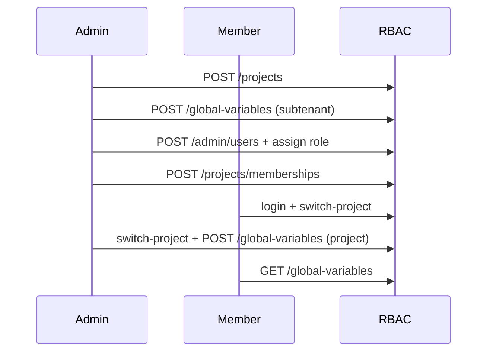

# Бизнес-сценарий: команда и проект

Tenant admin создаёт проект, добавляет участника, переключает project context и настраивает переменные. Сценарий проверен:

- `php maniforge/rbac/tools/team_project_journey.php`

## Предварительные условия

```bash
php -S 127.0.0.1:8092 -t public public/index.php
php maniforge/rbac/tools/team_project_journey.php
```

---

## Этап 1. Создание проекта

```http
POST /rbac/api/v1/projects
X-Action-Token: {action_token}

{
  "code": "mobile-app",
  "name": "Mobile App",
  "metadata": { "env": "dev" },
  "warehouse_id": 12
}
```

`warehouse_id` — опциональная ссылка на корневой склад (`maniforge_wh_stocks`, `type=warehouse`) в scope subtenant. Создайте склад через `POST /warehouses/api/v1/stocks` до привязки.

---

## Этап 2. Переменные subtenant scope

```http
POST /rbac/api/v1/global-variables

{
  "key": "stage",
  "value": "staging",
  "scope_level": "subtenant"
}
```

---

## Этап 3. Добавление участника

1. `POST /api/v1/admin/users` — создать пользователя
2. `POST /api/v1/admin/user-roles/assign` — назначить роль `user`
3. `POST /api/v1/projects/memberships` — привязать к проекту

```http
POST /rbac/api/v1/projects/memberships

{ "user_id": 43, "project_code": "mobile-app" }
```

---

## Этап 4. Switch-project

Участник переключает project context:

```http
POST /rbac/api/v1/auth/switch-project

{ "project_id": 7 }
```

`GET /me` возвращает `project_id` и `project_code` в session.

---

## Этап 5. Переменные project scope

Admin (tenant_admin) создаёт переменную уровня project после switch-project:

```http
POST /rbac/api/v1/global-variables

{
  "key": "api_env",
  "value": "production",
  "scope_level": "project"
}
```

`GET /api/v1/global-variables` в project context показывает subtenant + project переменные.

---

## Диаграмма



---

## Быстрые команды

```bash
php maniforge/rbac/tools/team_project_journey.php
php maniforge/rbac/tools/business_journeys_suite.php
```
