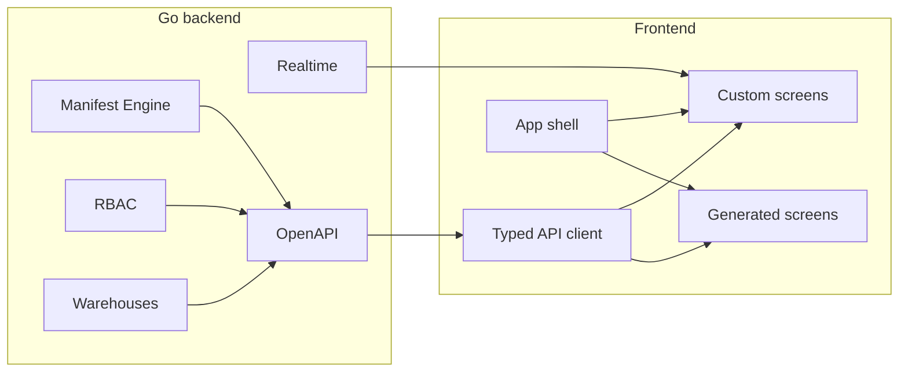

# Maniforge — стратегия UI

Документ фиксирует **методику** разработки фронтенда: API-first, schema-driven UI, постепенная замена PHP-шаблонов.

Связанные документы: [MANIFORGE_PLATFORM_OVERVIEW.md](MANIFORGE_PLATFORM_OVERVIEW.md), [MANIFORGE_REALTIME.md](MANIFORGE_REALTIME.md), [MANIFORGE_WMS_SCANNER_UI.md](MANIFORGE_WMS_SCANNER_UI.md), [MANIFORGE_MANIFEST_ENGINE.md](MANIFORGE_MANIFEST_ENGINE.md).

**Текущий статус:** PHP-шаблоны (`templates/`) + браузерный CRUD `/refine-manifest`; полноценный React SPA — в разработке.

---

## 1. Рекомендуемая стратегия: API-first + schema-driven UI

Не выбирать «один фреймворк навсегда», а опираться на то, что уже есть: OpenAPI, Manifest Engine, RBAC-сессия, Realtime WebSocket.



**Идея:** ~80% экранов — из манифеста/OpenAPI; ~20% — кастом (склад, сканер, realtime-лента).

---

## 2. Стек

| Слой | Рекомендация | Почему для Maniforge |
|------|--------------|----------------------|
| Framework | React 19 + TypeScript | Refine scaffold, экосистема |
| Admin / CRUD | Refine v4 | Связка с Manifest + OpenAPI; `/refine-manifest` — прототип |
| Сборка | Vite | Быстрая dev-сборка |
| Серверное состояние | TanStack Query | Кэш, retry, invalidation после WS-событий |
| Клиентское состояние | Zustand (минимум) | tenant/project context, WS connection |
| Формы | React Hook Form + Zod | Zod можно генерить из JSON Schema манифеста |
| UI kit | shadcn/ui + Radix | Доступность, кастомизация |
| Realtime | WebSocket + thin hook | Протокол: [MANIFORGE_REALTIME.md](MANIFORGE_REALTIME.md) |
| Маршрутизация | React Router v7 | SPA внутри app shell |

**Не на старте:** Next.js как основа админки (SSR не нужен), Redux, микрофронтенды.

---

## 3. Методика разработки: Strangler Fig

Постепенная замена PHP, без big-bang rewrite.

| Фаза | Содержание |
|------|------------|
| **A** ✅ | App shell — React SPA на `/app/*` |
| **B** ✅ | Manifest CRUD — замена `/refine-manifest` |
| **C** ✅ | Warehouses — tree + audit |
| **D** ✅ | Realtime — live updates на Manifest |
| **E** ✅ | WMS scanner — PWA (Hub, lookup, receipt, issue, ГУ, паллета) |

PHP-шаблоны остаются для лендинга и legacy; новые модули — только в SPA.

Логику `public/assets/js/maniforge-session.js` (Bearer, CSRF, action token, switch-context) переносим в TS SDK один раз.

---

## 4. Contract-first UI

Порядок работы:

1. OpenAPI / manifest — источник истины.
2. `openapi-typescript` или `orval` → типизированный клиент.
3. Refine resources генерятся из manifest (`make manifest-refine-gen` — расширить).
4. Journey-тесты API = контракт; UI e2e — только критические flow.

Снимает рассинхрон «бэкенд поменял поле — UI сломался».

---

## 5. Design tokens + component library

Сейчас стиль размазан по PHP (`app-button`, Bootstrap). Для SPA:

- **Tailwind + CSS variables** — tenant branding (`templates/data/branding.php` → JSON tokens).
- **Storybook** — каталог: Table, Tree, ScanField, ContextSwitcher.
- **WCAG AA** — особенно для WMS-сканера (см. [MANIFORGE_WMS_SCANNER_UI.md](MANIFORGE_WMS_SCANNER_UI.md)).

Один design system на admin + scanner + manifest screens.

---

## 6. Realtime-driven UI

Не polling, а event-sourced refresh:

```text
WS event → invalidate TanStack Query keys → UI обновляется
```

Примеры:

- `record.updated` на `data.product` → `queryClient.invalidateQueries(['product'])`
- `warehouses.stock.created` (когда появится broadcast) → invalidate `['stocks', 'tree']`

Подписки через REST `/api/v1/subscriptions` — не хардкодить каналы в каждом экране.

---

## 7. Структура кода (Feature-Sliced Design, упрощённо)

```text
frontend/src/
  app/          — shell, router, providers
  shared/       — api client, ui kit, hooks (useSession, useRealtime)
  entities/     — Stock, Manifest, Subscription (types + queries)
  features/     — create-stock, switch-context, subscribe-channels
  widgets/      — stocks-tree, manifest-table, event-feed
  pages/        — warehouses, manifests, admin
```

Для MVP достаточно `shared/ + features/ + pages/`.

---

## 8. Тестирование UI

| Уровень | Инструмент | Что покрывать |
|---------|------------|---------------|
| Unit | Vitest | Zod-валидация, WS message parser |
| Component | Testing Library | формы, tree node |
| E2E | Playwright | login → switch context → CRUD manifest → WS event |

E2E — против Go journey-окружения (`make run-rbac`, `make manifest-journey`).

---

## 9. WMS Scanner — отдельная ветка: PWA + mobile-first

Для ТСД/телефона не тащить тяжёлую админку:

- Vite PWA (offline v2 — позже).
- Один экран = одна операция (приёмка, отгрузка).
- BarcodeDetector API + fallback на ручной ввод.
- Крупные touch targets, haptic feedback.

Отдельное mini-app в monorepo (`apps/scanner`, `apps/admin`). Спека UX: [MANIFORGE_WMS_SCANNER_UI.md](MANIFORGE_WMS_SCANNER_UI.md).

---

## 10. Monorepo (при масштабировании)

```text
frontend/
  apps/admin/         — Refine SPA
  apps/scanner/       — PWA
  packages/api-sdk/   — openapi-typescript
  packages/ui/        — shadcn components
  packages/realtime/  — WS client
```

Turborepo или pnpm workspaces — когда появится 2+ приложения. Пока одного `apps/admin` достаточно.

---

## 11. Чего избегать на старте

- Полный rewrite PHP-админки за один спринт.
- AI-генерацию UI как основной pipeline (scaffold — да, production — нет).
- GraphQL поверх REST (field-level REST — фича платформы).
- Отдельный BFF на Node (Go API достаточно).

---

## 12. Текущее состояние UI

| Область | Статус |
|---------|--------|
| PHP-админка (`/admin`, `/profile`, `/projects`) | Работает |
| **React Admin SPA** (`/app`) | Фазы A–D: login, dashboard, Manifest CRUD, Warehouses tree, Realtime hook |
| Manifest UI (`/refine-manifest`) | PHP-прототип CRUD (legacy) |
| Refine scaffold | `make manifest-refine-gen` → `templates/refine-manifest/generated/` |
| API-документация (`/api`) | Есть, в т.ч. Warehouses — UX-план: [MANIFORGE_API_DOCS_UX.md](MANIFORGE_API_DOCS_UX.md) |
| Realtime UI | Hook `useRealtime` на `/app/manifest` |
| Warehouses UI | `/app/warehouses` — tree + audit + create |
| WMS Scanner UI | `/scanner` — приёмка, отгрузка, сборка ГУ, lookup |

---

## 13. Порядок реализации (backlog)

1. ✅ **Скелет SPA** — `frontend/apps/admin`, `make frontend-build` → `public/app/`, маршрут `/app`.
2. ✅ **Session SDK** — `src/shared/auth/session.ts` (паритет localStorage с PHP).
3. ✅ **Manifest** — list + CRUD (`/app/manifest`, модалка create/edit/delete).
4. ✅ **Realtime hook** — `useRealtime` + auto-refresh на Manifest.
5. ✅ **Warehouses tree** — `/app/warehouses` (дерево + создание узла).
6. ✅ **Warehouses audit** — журнал по выбранному узлу.
7. 🟡 **WMS scanner** — `/scanner`: Hub, lookup, receipt, issue, сборка ГУ.
8. ✅ **Scanner pallet** — `/scanner/pallet`: children + seal + CTA приёмка.

---

## 14. Сервисы и порты (для dev proxy)

| Сервис | Порт | Prefix |
|--------|------|--------|
| RBAC | 8093 | `/rbac` |
| Manifest Engine | 8095 | — |
| Realtime | 8097 | `/realtime` |
| Warehouses | 8098 | `/warehouses` |
| PHP (legacy) | 8092 | — |

Env для фронта: `MANIFORGE_REALTIME_URL=ws://127.0.0.1:8097` (см. [MANIFORGE_REALTIME.md](MANIFORGE_REALTIME.md)).
