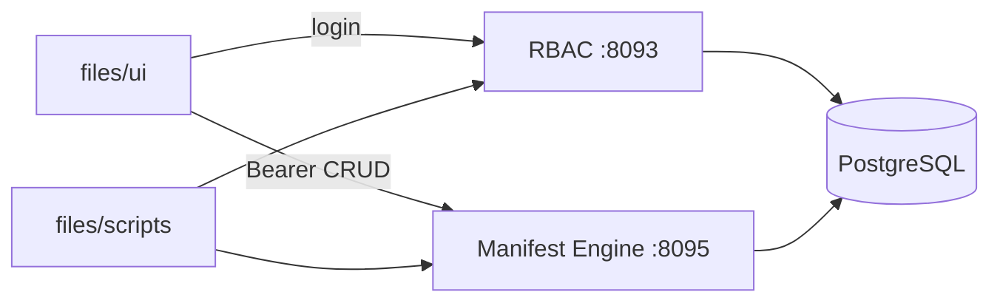

# Access Desk — technical guide

Пример модуля **временных пропусков** (`access_pass`) на self-hosted Maniforge: **RBAC** (вход) + **Manifest Engine** (сущность → REST).

Маркетинговое описание: [`marketing.md`](marketing.md). Артефакты: [`files/`](files/).

---

## 1. Архитектура



| Компонент | Роль в примере |
|-----------|----------------|
| Go RBAC `:8093` | Login, access/refresh token, tenant / project scope |
| Manifest Engine `:8095` | Схема `access_pass` + `/api/data/access_pass` |
| PostgreSQL `:5433` | Общая БД платформы |
| `files/ui` | Демо-страница (статика) |
| `files/scripts` | Воспроизводимый CLI-сценарий |

Платформа уже даёт auth. Модуль добавляет **только** бизнес-сущность и UX вокруг неё.

---

## 2. Предварительные требования

Из корня репозитория:

```bash
cp .env.example .env
make pg-up
make deps && make build && make migrate
make run-rbac        # :8093
make run-manifest    # :8095
```

Демо-учётка (phone-first, после seed):

```bash
# из корня репозитория
./bin/maniforge-agency-demo-seed
```

| | |
|---|---|
| phone | `+79000000003` |
| password | `DemoAdmin!12345` |
| tenant | `agency-demo` / `main` |

Либо без seed: `bash files/scripts/00b_register_operator.sh` — скрипт сам напишет `files/.env`.

Проверка:

```bash
curl -s http://127.0.0.1:8093/rbac/health
curl -s http://127.0.0.1:8095/health
```

Скопируйте env примера:

```bash
cp examples/00_access_desk/files/env.example examples/00_access_desk/files/.env
# при необходимости поправьте логин/пароль/URL
```

---

## 3. Сущность `access_pass`

Файл: [`files/manifest.access_pass.json`](files/manifest.access_pass.json)

| Поле | Тип | Смысл |
|------|-----|--------|
| `guest_name` | string, required | ФИО / название подрядчика |
| `guest_phone` | string | Контакт |
| `zone` | string, required | Зона: `warehouse`, `office`, `yard`… |
| `valid_from` | string | ISO-дата начала |
| `valid_until` | string, required | ISO-дата окончания |
| `status` | string | `active` \| `revoked` \| `expired` |
| `issued_by` | string | Кто выдал (логин оператора) |
| `note` | string | Комментарий |

`origin` будет `custom` — клиентский манифест (не platform preset).

---

## 4. Сценарий API (вручную)

### 4.1. Login

```bash
TOKEN=$(curl -s -X POST "$RBAC_URL/api/v1/auth/login" \
  -H 'Content-Type: application/json' \
  -d "{\"phone\":\"$PHONE\",\"password\":\"$PASSWORD\",\"tenant_id\":\"$TENANT_ID\",\"subtenant_id\":\"$SUBTENANT_ID\"}" \
  | jq -r '.session.access_token // .access_token // empty')
```

Префикс RBAC в Go: `http://127.0.0.1:8093/rbac`.

### 4.2. Создать манифест

```bash
curl -s -X POST "$MANIFEST_URL/api/v1/manifests" \
  -H "Authorization: Bearer $TOKEN" \
  -H 'Content-Type: application/json' \
  -d @files/manifest.access_pass.json
```

Повторный POST с тем же `code` вернёт конфликт — это нормально, если схема уже есть.

### 4.3. Выдать пропуск

```bash
curl -s -X POST "$MANIFEST_URL/api/data/access_pass" \
  -H "Authorization: Bearer $TOKEN" \
  -H 'Content-Type: application/json' \
  -d '{
    "guest_name": "ООО Подряд Строй",
    "guest_phone": "+79001234567",
    "zone": "warehouse",
    "valid_from": "2026-08-11",
    "valid_until": "2026-08-18",
    "status": "active",
    "issued_by": "demo-admin",
    "note": "Разгрузка ворот B"
  }'
```

### 4.4. Список / отзыв

```bash
# список
curl -s "$MANIFEST_URL/api/data/access_pass" \
  -H "Authorization: Bearer $TOKEN"

# field-level: отозвать (подставьте RECORD_ID)
curl -s -X PATCH "$MANIFEST_URL/api/data/access_pass/$RECORD_ID/fields/status" \
  -H "Authorization: Bearer $TOKEN" \
  -H 'Content-Type: application/json' \
  -d '{"value":"revoked"}'
```

OpenAPI схемы: `GET $MANIFEST_URL/api/v1/manifests/access_pass/openapi`.

---

## 5. Скрипты

Все из каталога `files/scripts/` (нужны `curl`, `jq`, `bash`).

```bash
cd examples/00_access_desk/files
set -a && source .env && set +a

bash scripts/01_login.sh
bash scripts/02_create_manifest.sh
bash scripts/03_issue_pass.sh
bash scripts/04_list_passes.sh
# RECORD_ID=... bash scripts/05_revoke_pass.sh
```

Токен сохраняется в `files/.session.json` (в `.gitignore` примера через общий ignore `*.local` / не коммитить).

---

## 6. UI

Статика без сборки:

```bash
cd examples/00_access_desk/files/ui
php -S 127.0.0.1:8760 -t .
# → http://127.0.0.1:8760/
```

Страница логинится в RBAC (CORS: в local Manifest/RBAC обычно разрешают localhost; если браузер блокирует — используйте скрипты или проксируйте через PHP web `:8092`).

---

## 7. Как это ложится на платформу

| Вопрос | Ответ Maniforge |
|--------|-----------------|
| Кто может входить? | RBAC users / roles / MFA |
| Где данные? | `maniforge_manifest_records` + `tenant_id` / `project_id` |
| Нужен ли свой backend? | Нет для CRUD; кастомная логика (SMS, турникет) — рядом webhook / ваш сервис |
| Как масштабировать? | Тот же паттерн: новый `code` манифеста или Go-модуль в `cmd/` |

### Расширения «на завтра»

1. Политика: `write_roles` на поля (когда enforcement в Manifest Engine включится).
2. Realtime: подписка на `data.access_pass` (см. `docs/MANIFORGE_REALTIME.md`).
3. Refine UI: `make manifest-refine-gen` для admin-экрана.
4. Вынести в отдельный Go `cmd/access-desk`, если нужна доменная логика (авто-expire, интеграция СКУД).

---

## 8. Проверка «всё живо»

```bash
bash files/scripts/00_prereq.sh
bash files/scripts/01_login.sh && bash files/scripts/02_create_manifest.sh
bash files/scripts/03_issue_pass.sh && bash files/scripts/04_list_passes.sh
```

Ожидание: JSON с `ok`/записью пропуска и `status: active`.

---

## 9. Связанные документы платформы

- [`docs/MANIFORGE_MANIFEST_ENGINE.md`](../../docs/MANIFORGE_MANIFEST_ENGINE.md)
- [`docs/MANIFORGE_PLATFORM_OVERVIEW.md`](../../docs/MANIFORGE_PLATFORM_OVERVIEW.md)
- [`docs/openapi/rbac.yaml`](../../docs/openapi/rbac.yaml)
- [`STRUCTURE.md`](../../STRUCTURE.md)
