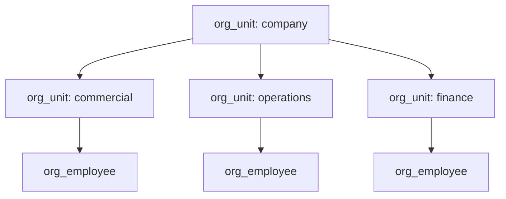

# Org Structure — technical guide

Пример **оргструктуры компании** на self-hosted Maniforge: сущности `org_unit` + `org_employee` через Manifest Engine, вход через RBAC.

Маркетинг: [`marketing.md`](marketing.md). Артефакты: [`files/`](files/).

---

## 1. Модель



| Сущность | Назначение |
|----------|------------|
| `org_unit` | Узел дерева: company / division / department / team |
| `org_employee` | Сотрудник с `unit_code`, должностью, контактами |

Связь логическая по `code` / `unit_code` (без FK в MVP Manifest Engine — как в типичном JSON-справочнике).

---

## 2. Предварительные требования

```bash
# корень репозитория
make pg-up && make run-rbac && make run-manifest
./bin/maniforge-agency-demo-seed   # или scripts/00b_register_operator.sh
```

| | |
|---|---|
| phone | `+79000000003` |
| password | `DemoAdmin!12345` |
| tenant | `agency-demo` / `main` |

```bash
cp examples/01_org_structure/files/env.example examples/01_org_structure/files/.env
```

---

## 3. Поля

### org_unit — [`files/manifest.org_unit.json`](files/manifest.org_unit.json)

| Поле | Тип | Смысл |
|------|-----|--------|
| `code` | string, required | Уникальный код узла (`co`, `ops`, `ops-wh`) |
| `name` | string, required | Название |
| `unit_type` | string, required | `company` \| `division` \| `department` \| `team` |
| `parent_code` | string | Родитель (`""` у корня) |
| `status` | string | `active` \| `archived` |
| `head_title` | string | Должность руководителя узла |
| `note` | string | Комментарий |

### org_employee — [`files/manifest.org_employee.json`](files/manifest.org_employee.json)

| Поле | Тип | Смысл |
|------|-----|--------|
| `full_name` | string, required | ФИО |
| `unit_code` | string, required | Код подразделения |
| `position` | string, required | Должность |
| `email` | string | Email |
| `phone` | string | Телефон |
| `status` | string | `active` \| `dismissed` |
| `hired_at` | string | Дата приёма YYYY-MM-DD |

---

## 4. Скрипты

```bash
cd examples/01_org_structure/files
set -a && source .env && set +a

bash scripts/00_prereq.sh
bash scripts/01_login.sh
bash scripts/02_create_manifests.sh
bash scripts/03_seed_structure.sh
bash scripts/04_list.sh
```

Seed создаёт компанию «Север Торг», три дивизиона и несколько сотрудников.

---

## 5. UI

```bash
cd examples/01_org_structure/files/ui
php -S 127.0.0.1:8761 router.php
# → http://127.0.0.1:8761/
```

Proxy `/proxy/rbac` и `/proxy/manifest` — как в Access Desk (без CORS).

---

## 6. API (кратко)

```bash
# создать отдел
curl -s -X POST "$MANIFEST_URL/api/data/org_unit" \
  -H "Authorization: Bearer $TOKEN" -H 'Content-Type: application/json' \
  -d '{"code":"ops-wh","name":"Склад","unit_type":"department","parent_code":"ops","status":"active"}'

# сотрудник
curl -s -X POST "$MANIFEST_URL/api/data/org_employee" \
  -H "Authorization: Bearer $TOKEN" -H 'Content-Type: application/json' \
  -d '{"full_name":"Иванов И.И.","unit_code":"ops-wh","position":"Кладовщик","status":"active","hired_at":"2026-01-15"}'
```

---

## 7. Расширения

- Связать `org_employee` с RBAC user через `phone` / entity_meta
- Realtime на `data.org_unit` при изменении дерева
- Export в CSV / 1С по OpenAPI манифеста
- Отдельный Go-модуль, если понадобятся жёсткие FK и иерархические запросы

Документы платформы: [`docs/MANIFORGE_MANIFEST_ENGINE.md`](../../docs/MANIFORGE_MANIFEST_ENGINE.md).
